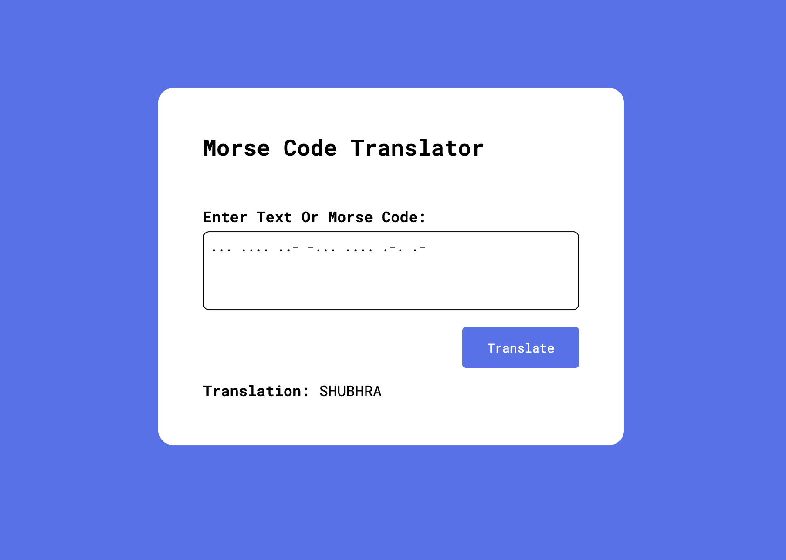

# __Morse Code Translator__
This is a simple Morse code translator developed using JavaScript. It translates text input into Morse code and vice versa. The translator is built with simplicity and ease of use in mind, making it suitable for anyone interested in Morse code or looking for a fun tool to explore.
## __Features__
* Converts text input to Morse code and Morse code input to text.
* Supports alphanumeric characters and common punctuation marks.
* Easy-to-use interface with clear instructions.
## __Snapshots__
